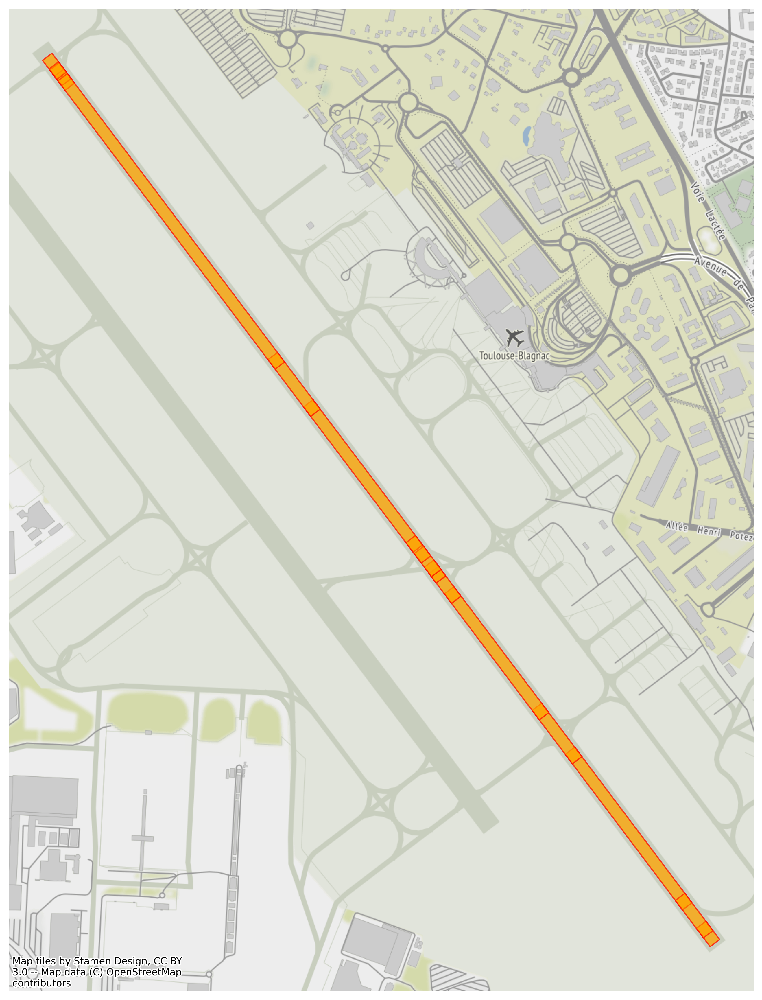

# Airports OSM

Extract and visualize airport data (ex: runway geocoordinates) from OpenStreetMap with Python tools

Airport data are extracted with [OSMnx](https://github.com/gboeing/osmnx), stored as graphs or 
GeoPandas](http://geopandas.org/) dataframes, and visualized with [Matplotlib](https://matplotlib.org/).

The map background to check data is built with [contextily](https://github.com/darribas/contextily)

Example 1: visualize main European airport maps

Example 2: airport runway data on top of background map

## Running the tests

Run the following notebooks to load and visualize air traffic data:

* demo_top_European_airports: notebook to load data from main European airports and plot them as maps

* demo_airport_runway: notebook to load all data related to an airport, extract runway information as geodataframe and visualize on top of a background map to check data

Run the

## Built With

* [OSMnx](https://github.com/gboeing/osmnx) - Python package to download geospatial data from OpenStreetMap

* [GeoPandas](http://geopandas.org/) - Open source project which extends the datatypes used by pandas to allow spatial operations on geometric types. 

* [contextily](https://github.com/darribas/contextily) - Context geo-tiles in Python

* [Matplotlib](https://matplotlib.org/) - Comprehensive library for creating static, animated, and interactive visualizations in Python

## Authors

* **Thomas Dubot** 

## License

This project is licensed under the MIT License - see the [LICENSE.md](LICENSE.md) file for details

## Acknowledgments

Thanks to all OpenStreetMap contributors: https://www.openstreetmap.org/